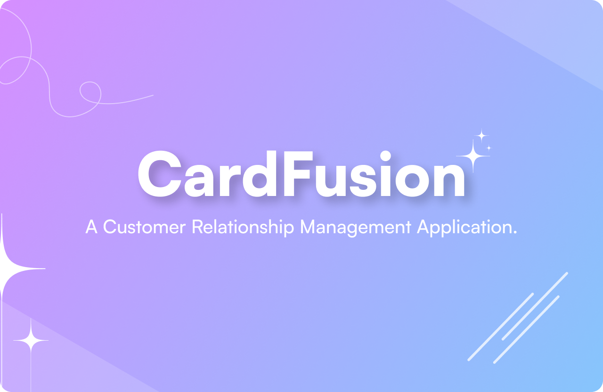

## CardFusion



<p align="left">A Customer Relationship Management Application.</p>

###

<h2 align="left">💻 Technology Stacks Used</h2>

| Technologies     | Version        |
|:--------------------:|:--------------:|
| Next.js              | v14.2.4        |
| React                | v18            |
| Dnd Kit (Core)       | v6.1.1         |
| Dnd Kit (Sortable)   | v8.0.0         |
| Dnd Kit (Utilities)  | v3.2.2         |
| Tailwind CSS         | v3.4.1         |
| React Snowfall       | v2.1.0         |

###

<h2 align="left">💻 Project Set Up</h2>

###

Clone the repository
```
git clone https://github.com/AtqiyaHaydar/SEASalon.git
```
Install dependencies
```
npm install
```
Run the project
```
npm run dev
```

###

<h2 align="left">🔗 Links</h2>

- [Canva Presentation](https://www.canva.com/design/DAGKjhGkrZ4/8uivnJRM3DE4kDyx0srTWw/edit)
- [Figma](https://www.figma.com/design/bCWUJRnTOiXlHxXXVtXMkf/CardFusion?node-id=0-1&t=KH8nWELsN43GlZI6-1)

### 

<h2 align="left">✨ Acknowledgements</h2>

This project is presented to Sir Alessandro Spada and Arfiano Jordhy. I am deeply grateful for the opportunity to intern at Purple Box. Thank you for your guidance and support throughout this experience.
